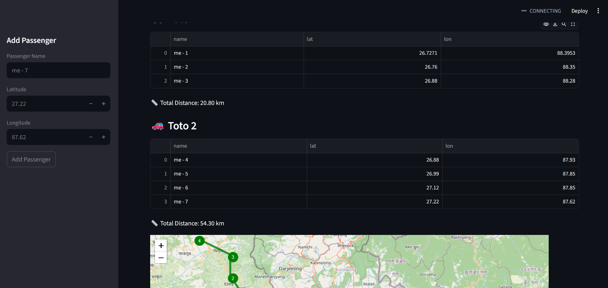

# 🚖 TotoFlow: AI-Powered Shared Mobility & Route Optimization System

TotoFlow is an AI-powered shared mobility platform that optimizes last-mile transportation using passenger clustering and intelligent route optimization.

---

## 💡 Key Idea

Convert informal e-rickshaw (toto) transport into an AI-driven logistics system by efficiently grouping passengers and optimizing travel routes.

---

## 🚀 Features

- 🤖 AI-based passenger grouping using K-Means clustering  
- 🧭 Route optimization using distance-based heuristics  
- 🚗 Multi-passenger ride sharing (up to 4 passengers per vehicle)  
- 🗺️ Interactive map visualization with routes  
- 📍 Numbered pickup points  
- 📏 Distance calculation for each route  

---

## 📸 Demo



---

## 🌍 Impact

- 🚗 Reduces empty rides  
- ⛽ Saves fuel  
- 📉 Reduces traffic congestion  
- 💰 Lowers travel cost  
- 🌱 Promotes sustainable urban mobility  

---

## 🧠 AI & Optimization

- K-Means clustering for intelligent passenger grouping  
- Greedy route optimization using geospatial distance  
- Real-time decision-making for efficient ride allocation  

---

## 🧰 Tech Stack

- Python  
- Streamlit  
- Folium  
- Scikit-learn  
- Geopy  

---

## ▶️ Run Locally

```bash
pip install -r requirements.txt
streamlit run frontend/app.py